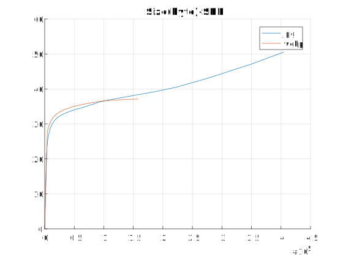
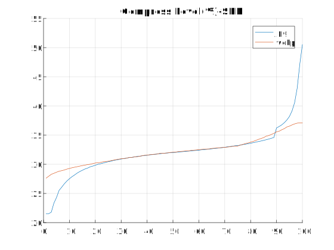

# WebP vs JPEG #

do WebP really better than JPEG ? Here is the experiment.

## What you need ##

* MATLAB (i didn't test on octave)
* cwebp
* convert

## How to use ##

* convert your test image to TIFF format.
* copy your TIFF test image to this dir and rename it to `src.tiff`.
* run `./run.sh`
* run `CalcSNR.m` from MATLAB
* wait the result

## demo result ##

I use `lena.tiff` as the test image.

### lossless WebP vs PNG ###

|Format         | Size          |
| ------------- |:-------------:| 
| PNG           | 474,775       | 
| WebP          | 427,646       |  

As you see lossless WebP is better than PNG.

### lossy WebP vs JPEG ###

I tested different image. I found JPEG is better than WebP if you want to get better quality of image.